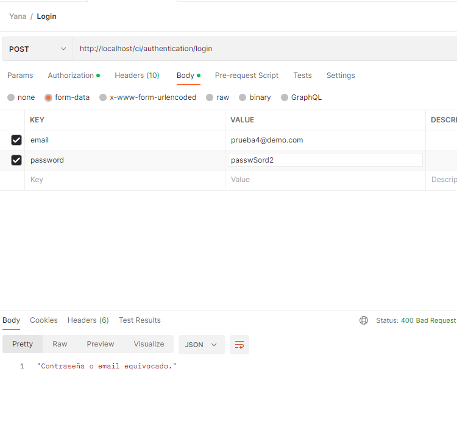
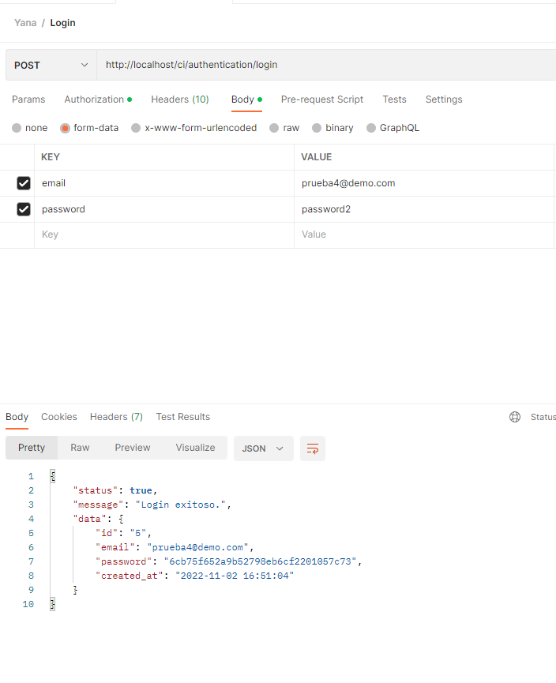
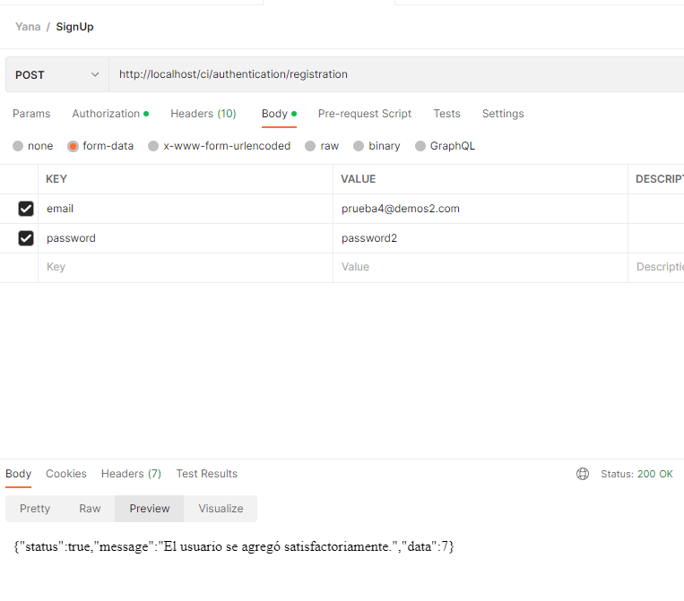
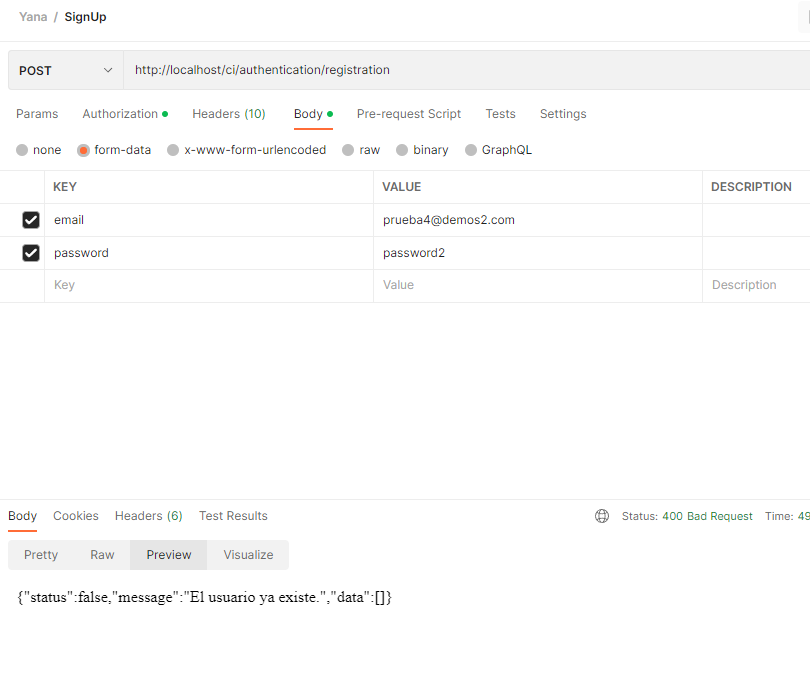
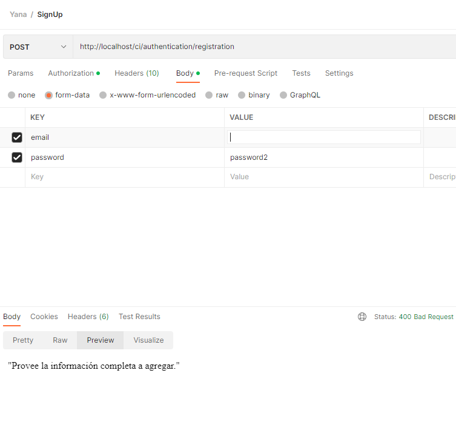
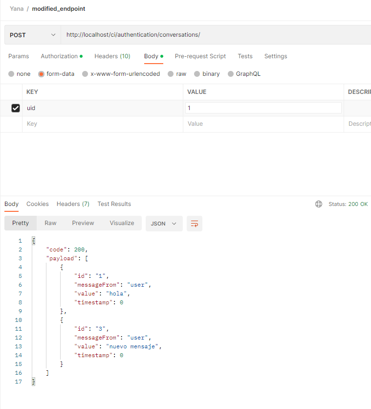
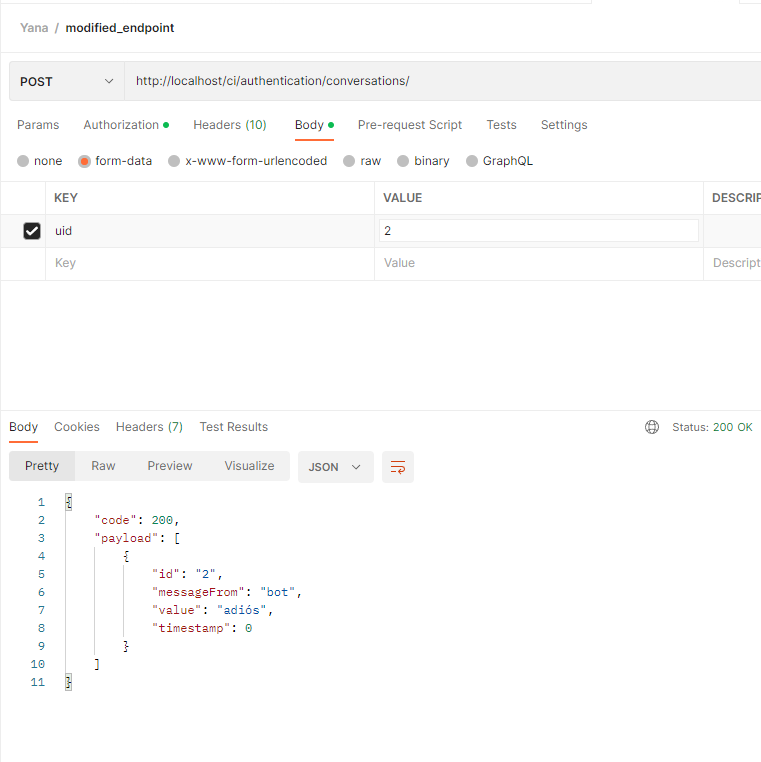
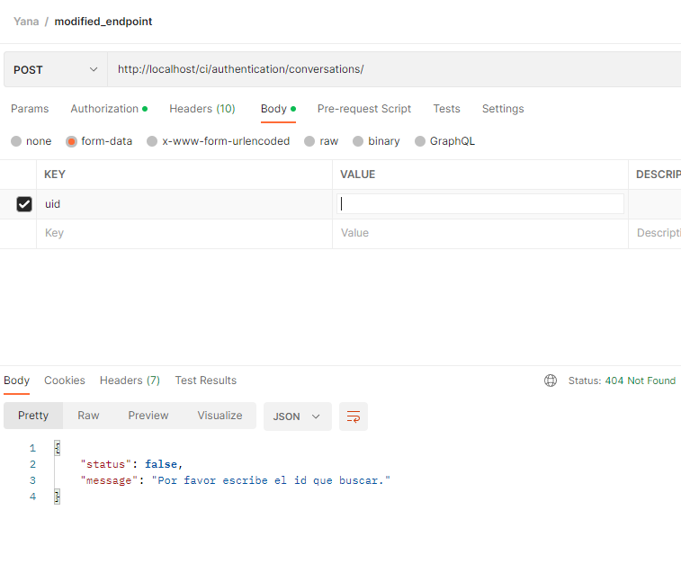
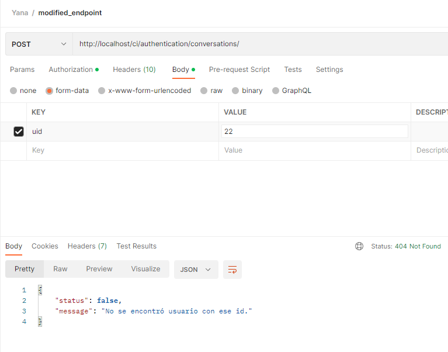

# Backend Challenge

#### 1. Crear un repositorio en **Github** para compartir tu código final con el equipo de tecnología de Yana. :robot:

- Se usó una librería preexistente para ayudar en el manejo de API: [RestServer](https://github.com/chriskacerguis/codeigniter-restserver). Los archivos que esa librería proveen están en: `application/libraries/REST_Controller.php`, `application/libraries/Format.php` y  `application/language/english/rest_controller_lang.php`. 
- Aunque el lenguaje que maneja este último controlador de idioma es inglés, pasé ese texto al español.
- Los archivos que yo cree son:  `application/models/User.php`, `application/models/User_activity_model.php` y `application/controllers/Authentication.php`

#### 2. Desarrolla un **endpoint** que reciba las credenciales de un usuario y que valide contra la tabla `users` si las credenciales son válidas para el inicio de sesión, de no ser el caso devolver el error adecuado al caso. 

Login Fail                           |  Login Success
:-----------------------------------:|:-------------------------:
 |  
    

    
#### 3. Desarrolla un **endpoint** que cree una cuenta nueva de un usuario recibiendo los campos necesarios para su creación.
    
New user Success                            |  Repeated user
:------------------------------------------:|:-------------------------:
 |  

New user missing info                           | 
:------------------------------------------:|

#### 4. Modifica el siguiente endpoint, este endpoint devuelve el historial de la conversación entre usuario y maquina de la tabla `user_activities`.

Get Conversations                                   |  Single conversation
:--------------------------------------------------:|:-------------------------:
 |  

Missing Info                                   |  User not found
:---------------------------------------------:|:-------------------------:
 |  

